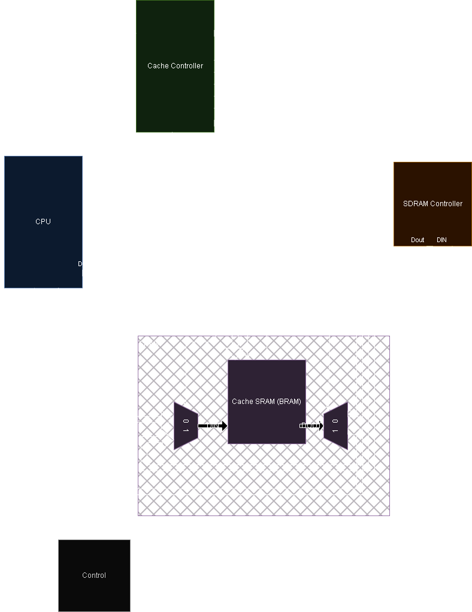
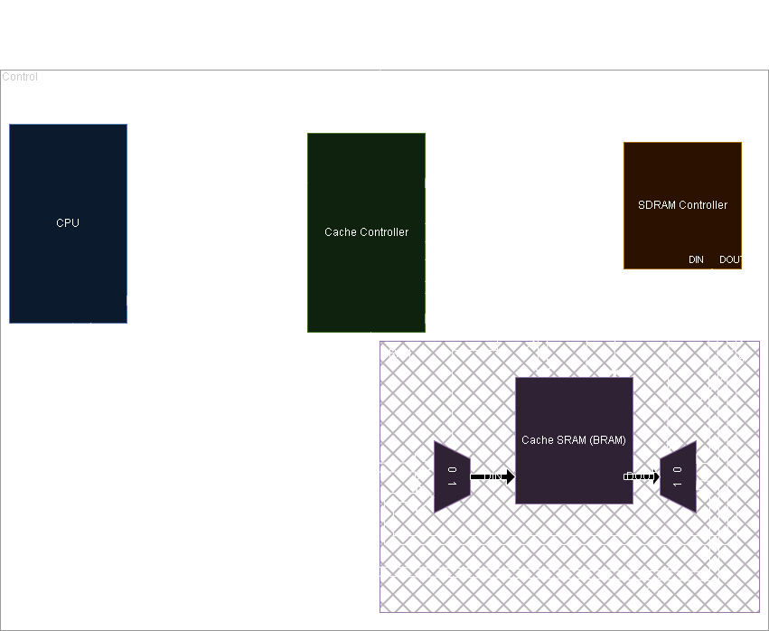
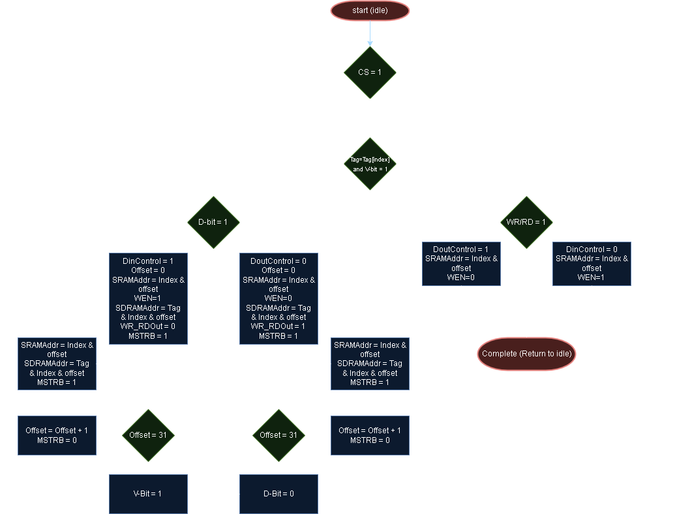
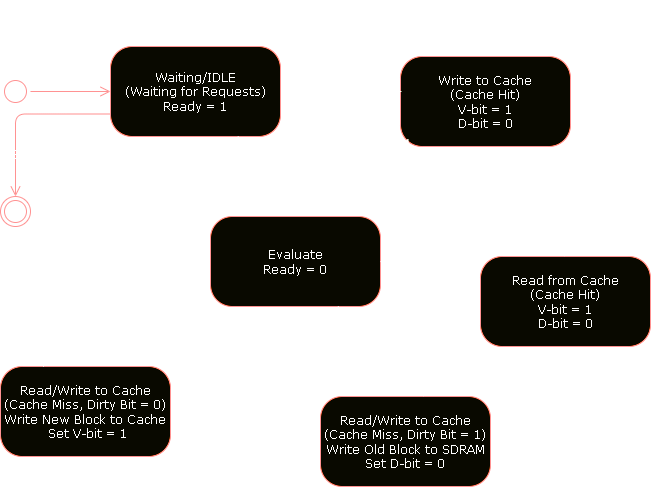

# Cache Controller

## Table of Contents
- [Cache Controller](#cache-controller)
  - [Table of Contents](#table-of-contents)
  - [Description](#description)
  - [Overview](#overview)
  - [Introduction](#introduction)
  - [Design Details](#design-details)
    - [Component Symbols](#component-symbols)
    - [System Block Diagram](#system-block-diagram)
    - [Process Diagram](#process-diagram)
    - [Cache Controller States](#cache-controller-states)
      - [IDLE State](#idle-state)
      - [Evaluate State](#evaluate-state)
      - [Write to Cache Hit](#write-to-cache-hit)
      - [Read from Cache Hit](#read-from-cache-hit)
      - [Read/Write Cache Miss D-bit is 0 (Clean Miss Case)](#readwrite-cache-miss-d-bit-is-0-clean-miss-case)
      - [Read/Write Cache Miss D-bit is 1 (Dirty Miss Case)](#readwrite-cache-miss-d-bit-is-1-dirty-miss-case)
    - [State Diagram](#state-diagram)
  - [Conclusion](#conclusion)

## Description
This is a simple cache controller that uses direct mapped cache to improve Random Access Memory (RAM) access time. The cache controller is implemented in VHDL in Xilinx ISE for the Xilinx Spartan-3E FPGA (Field Programmable Gate Array). This project was done as part of the course COE 758: Digital Systems Engineering at Toronto Metropolitan University. The assignment document for this project can be found [here](https://www.ee.torontomu.ca/~lkirisch/ele758/labs/Cache%20Project[12-09-10].pdf).

## Overview
In a memory hierarchy, the cache controller is a critical component that manages the interaction between various modules within a digital system, such as an SoC (System on Chip) or CPU (Central Processing Unit). The purpose of this project is to create and analyze the different components within a memory hierarchy system focusing on the cache controller. The cache has 256 bytes of total storage capacity organized into 32 8-bit word blocks and the cache has 8 blocks of capacity. A CPU component sends operations to the cache controller, which then decodes the instructions and controls the SRAM element that stores the cache data. Both the CPU and the cache controller use Finite State Machines (FSMs) to represent the various operations the CPU can issue and the states the cache controller must go through to execute those operations.

## Introduction
A cache controller is a piece of hardware that stands between a computer’s main memory and CPU that keeps a copy of frequently or recently used blocks of main memory. This cache is crucial to the CPU's operation because much of the data needed for a process is often sequential, meaning the CPU is likely to request data located at an index adjacent to the previously requested data. This data is then stored within close physical proximity to the CPU allowing for faster read and write latency of individual words of data. In modern SoC/CPU design, the cache is typically placed as close to the CPU as possible to ensure quick access and low latency, often with multiple layers to meet increasingly stringent latency requirements.

The purpose of the cache controller and the pseudo memory hierarchy was to explore the different functions of a cache controller with respect to reading and writing data. After a request is made by the CPU to read or write data there are steps that the cache controller must complete to ensure that the data it contains is both up to date in its own SRAM and the system’s SDRAM. For these purposes five components were created, a CPU, a cache controller, SRAM for the cache controller, a SDRAM controller that has its own SDRAM stored within and a control component which connects the system together.

When the Cache Controller is in its idle state it updates its ready flag allowing the CPU to send it a 16-bit address, a write/read signal, a chip select signal and data for write operations. Within the address the cache controller extracts a Tag, Index and Offset that represents the location of the data that needs to be read or written to within the SRAM cache. The tag is 8 bits, the index is 3 bits and the offset is 5 bits as shown in the below diagram Figure 1.

    

    <i>Figure 1: Cache Controller Address</i>

 

The cache controller stores the tags of the data that is stored within its cache to keep track of active blocks as well as the validity and dirty status of the block. The validity bit represents if the data stored for that tag is valid and can be used by the CPU whereas the dirty bit indicates that the data in the cache has been modified compared to what is stored in the SDRAM (system memory). The cache controller process starts by comparing the tag in the address given by the CPU and the current tag at the cache index given in the address. If they match the valid bit (v bit) needs to be checked to make sure the data is valid if it is then this is a hit case where the data in the cache can be read or written to without other steps. If the tags do not match this is a miss case where the dirty bit needs to be analyzed to see if the data in the cache has been modified. If the data in the cache is modified, then this data at the existing tag needs to be written back to the SDRAM (main memory) and then the new tag’s data needs to be written to the cache. If the data is not modified however, then the new tag’s data overwrites the existing data as it is the same as what is in SDRAM (main memory). During the block replacement process, a burst of data consisting of 32 words or one block is transferred between the SRAM (cache) and SDRAM (main memory). To achieve this, the entire block is selected, the offset is iterated 32 times, and the valid and dirty bits are set to 1 and 0, respectively. After this miss case the tag and validity need to be rechecked before completing the original requested read or write.

## Design Details
To better understand the design of the cache controller, the following sections will provide a detailed explanation of the components that make up the cache controller and how they interact with each other using diagrams.

### Component Symbols

    

    <i>Figure 2: Symbols for the components of the memory hierarchy. Shown in Green is the cache controller, shown in blue is the CPU, shown in orange is the SDRAM controller, shown in purple is the SRAM module and in black is the control component.</i>

### System Block Diagram

    

    <i>Figure 3: System Block Diagram showing connections between components shown in Figure 2 with the same colours to illustrate how the different components come together within the memory hierarchy system.</i>

### Process Diagram

    

    <i>Figure 4: Process Diagram of the cache controller.</i>

### Cache Controller States
From this we can come to the conclusion of the following states that are needed for the cache controller to function properly:

#### IDLE State
In the idle state, the cache controller waits for the CPU to request data. It transitions to the Evaluate state when the chip select signal is set to 1.

#### Evaluate State
In the evaluate state the cache controller sets the Ready bit to 0 to make sure no new operations occur during an existing operation. Then the cache controller compares the current tag in the address from the CPU with the current tag at the index in the cache to determine if it’s a hit or miss also considering the valid bit. If the tags are the same and the cache is valid it’s a hit and will proceed to the Write or Read state for a hit. If it’s a miss, the two tag values are different, the cache controller needs to check the dirty bit and if its 0 then the current cache data has not been modified and can be written over. If the dirty bit is 1 in a miss case, then the data in the cache needs to be written to main memory and then the new tag’s data can be read from the main memory.

#### Write to Cache Hit
In the write state the cache controller sets the SRAM to be written (WEN=1) at the SRAM address of the index and offset given in the address. The DinControl needs to be set to 0 to make sure that data is flowing into the SRAM from the CPU and the valid and dirty bits need to be set to 1 as the data has been modified. Then the state is changed to idle as the operation is complete.

#### Read from Cache Hit
In the read state the cache controller sets the SRAM to be read from (WEN=0) at the SRAM address of the index and offset given in the address. The DoutControl needs to be set to 1 to make sure that data is flowing into the CPU from the SRAM. Then the state is changed to idle as the operation is complete.

#### Read/Write Cache Miss D-bit is 0 (Clean Miss Case)
In the cache miss with a D-bit of 0 (Clean Miss Case) the cache controller sets the SRAM to be written (WEN=1) at the SRAM address of the index and offset given in the address. The DinControl needs to be set to 1 to make sure that data is flowing into the SRAM from the SDRAM controller also setting the SDRAM controller to be read from (WR_RD=0). The SDRAM address and the SRAM address offsets are iterated over 32 times 0 to 31 to move an entire block from the SDRAM controller (main memory) to the SRAM cache using the MSRB to show when the cache controller has set everything up and is ready to receive data. Finally, the valid bit is set to 1 to show that the data is valid. Then the state is changed to idle as the operation is complete.

#### Read/Write Cache Miss D-bit is 1 (Dirty Miss Case)
In the cache miss with a D-bit of 1 (Dirty Miss Case) the cache controller sets the SRAM to be read from (WEN=0) at the SRAM address of the index and offset given in the address. The DoutControl needs to be set to 0 to make sure that data is flowing into the SDRAM from the SRAM also setting the SDRAM controller to be written to (WR_RD=1). The SDRAM address and the SRAM address offsets are iterated over 32 times 0 to 31 to move an entire block from the SRAM cache to the SDRAM controller using the MSRB to show when the cache controller has set everything up and is ready to send data. Finally, the dirty bit is set to 0 to show that the data is no longer different to what is stored in main memory. Then the state is changed to the Read/Write Cache Miss D-bit is 0 (Clean Miss Case) state as the data in the main memory and cache is the same and the new tag’s data needs to be read into the cache.

### State Diagram

    

    <i>Figure 5: Cache Controller State Diagram that shows the different states within the cache controller, the conditions that are needed to enter a state and if needed how conditions are changed.</i>

## Conclusion
To conclude, a memory hierarchy system was created to allow for a better understanding of data caches and how they interact with other components in a SoC (System on Chip) or CPU (Central Processing Unit). This system was then analyzed to illustrate the implications of having a cache positive and negative. VHDL in Xilinx ISE was used to create the components within the memory hierarchy system and to create a VHDL test bench that can be used to analyze the system. The importance of caches is a clear latency reduction that can increase the number of operations that a CPU or SoC can perform within a given amount of time. There are also some operations that can occur that take more time compared to if there was no cache at all. This can be seen in block replacement and especially in block transfer and block replacement operations that are needed to oversee moving blocks between the main memory and the cache. There can also be situations where two processes are running that want to use the same index within the cache and keep overriding what the previous process has done; this is known as the ping pong effect. The ping pong effect can be an additional consideration that needs to be accounted for when designing a good cache system, the most common solution is to use multiple SRAM banks for storing data. The cache controller is a critical component in a memory hierarchy system that can have a significant impact on the overall performance of a digital system.